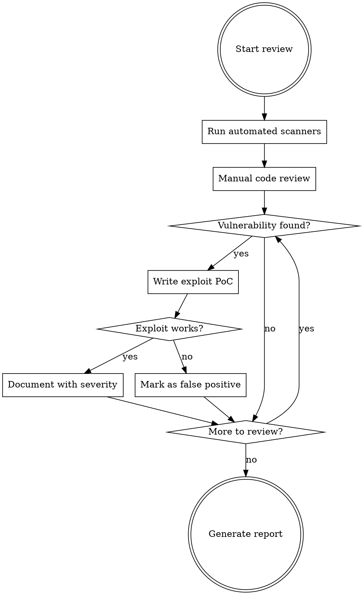

# Security Review & Exploit Development

## Overview

Systematic security review using automated tools AND manual analysis, with working proof-of-concept exploits for every finding. **No vulnerability is confirmed until exploited.**

## The Iron Law

```text
NO FINDING WITHOUT A WORKING EXPLOIT
```

Suspecting a vulnerability is worthless. You must prove exploitation.

## Workflow



## Phase 1: Automated Scanning

**Run ALL applicable tools.** Don't skip tools because "manual review is enough."

### Static Analysis (SAST)

```bash
# Opengrep - Multi-language SAST (preferred over semgrep)
opengrep scan --config=auto --config=p/security-audit --config=p/owasp-top-ten .

# Bandit - Python security linter
bandit -r . -f json -o bandit-report.json

# ast-grep - Custom pattern matching (write rules for project-specific issues)
ast-grep scan --rule security-rules/

# ESLint security plugin (JS/TS)
npx eslint --plugin security --rule 'security/detect-child-process: error' .

# Gosec - Go security checker
gosec -fmt=json -out=gosec-report.json ./...
```

### Dependency Scanning (SCA)

```bash
# Trivy - Comprehensive vulnerability scanner
trivy fs --scanners vuln,secret,misconfig .

# Grype - Fast vulnerability scanner
grype dir:. -o json > grype-report.json

# pip-audit - Python dependencies
pip-audit --format=json -o pip-audit.json

# npm audit - Node.js dependencies
npm audit --json > npm-audit.json

# govulncheck - Go dependencies
govulncheck ./...
```

### Secret Detection

```bash
# Gitleaks - Find secrets in git history
gitleaks detect --source . --report-path gitleaks-report.json

# Trufflehog - Deep secret scanning
trufflehog filesystem . --json > trufflehog-report.json
```

### Container/Infrastructure

```bash
# Trivy for containers
trivy image --severity HIGH,CRITICAL <image-name>

# Checkov for IaC
checkov -d . --framework terraform,kubernetes,dockerfile
```

## Phase 2: Manual Code Review

Focus on these vulnerability categories in order of severity:

### Critical: Injection Vulnerabilities

| Type               | Pattern to Find                          | Grep Command                                                                        |
| ------------------ | ---------------------------------------- | ----------------------------------------------------------------------------------- |
| Command Injection  | `exec`, `spawn`, `system`, `eval`        | `grep -rn "exec\|spawn\|system\|eval\|Function(" --include="*.ts" --include="*.js"` |
| SQL Injection      | String concatenation in queries          | `grep -rn "query.*\+" --include="*.ts"`                                             |
| Path Traversal     | `readFile`, `resolve` without validation | `grep -rn "readFileSync\|readFile\|resolve" --include="*.ts"`                       |
| Template Injection | User input in templates                  | `grep -rn "render\|template" --include="*.ts"`                                      |

### High: Authentication/Authorization

| Type                  | Pattern to Find                     |
| --------------------- | ----------------------------------- |
| Missing auth checks   | Routes without middleware           |
| Hardcoded credentials | `password`, `secret`, `key` in code |
| Weak crypto           | `md5`, `sha1`, `Math.random`        |

### Medium: Data Exposure

| Type                   | Pattern to Find                        |
| ---------------------- | -------------------------------------- |
| Sensitive data in logs | `console.log`, `logger` with user data |
| Error message leakage  | Full stack traces returned to client   |
| Insecure storage       | Credentials in config files            |

## Phase 3: Verification

**Every identified vulnerability MUST be verified with evidence before reporting.**

### How to Verify

For each candidate vulnerability, confirm exploitability by:

1. **Reproducing the condition** in a local dev environment or isolated test — never against production systems without explicit written authorization.
2. **Capturing evidence**: a request/response pair, log output, or test assertion that shows the vulnerable path is reachable and the impact is as stated.
3. **Classifying impact accurately**: distinguish between theoretical and demonstrated impact when writing the finding.

Specific exploitation techniques and payload catalogues are intentionally omitted from this document. Consult the [OWASP Testing Guide](https://owasp.org/www-project-web-security-testing-guide/) and [PortSwigger Web Security Academy](https://portswigger.net/web-security) for class-specific verification guidance in authorized testing contexts.

### Verification Checklist

- [ ] Vulnerability is reproducible in a controlled environment
- [ ] Evidence (request, response, log, assertion) is captured
- [ ] Impact is stated as demonstrated, not theoretical
- [ ] No production systems or user data were accessed without authorization

## Phase 4: Severity Classification

| Severity     | Criteria                                      | Examples                                           |
| ------------ | --------------------------------------------- | -------------------------------------------------- |
| **Critical** | RCE, full system compromise, auth bypass      | Command injection, SQL injection with admin access |
| **High**     | Significant data breach, privilege escalation | Path traversal to sensitive files, IDOR            |
| **Medium**   | Limited data exposure, DoS                    | Error message leakage, resource exhaustion         |
| **Low**      | Minor information disclosure                  | Version disclosure, missing headers                |

## Report Template

Use this structure for each finding:

**Finding:** `[Vulnerability Name]`

- **Severity:** Critical / High / Medium / Low
- **Location:** `file.ts:42`
- **CWE:** CWE-XXX

**Description:** What the vulnerability is and why it is dangerous.

**Vulnerable Code:** Paste the relevant snippet with file and line reference.

**Proof of Concept:** Describe the reproduction steps; include the request, response, or
test assertion that demonstrates the issue. Do not commit live payloads or output from
production systems.

**Impact:** What an attacker can achieve; data at risk; business impact.

**Remediation:** The corrected code or recommended configuration.

**References:** CVE identifier, OWASP link, or relevant advisory.

## Tool Installation

```bash
# Install all security tools
pip install opengrep bandit pip-audit
npm install -g eslint eslint-plugin-security
go install github.com/securego/gosec/v2/cmd/gosec@latest
go install golang.org/x/vuln/cmd/govulncheck@latest

# Trivy
brew install trivy  # macOS
# or: curl -sfL https://raw.githubusercontent.com/aquasecurity/trivy/main/contrib/install.sh | sh

# Grype
brew install grype  # macOS
# or: curl -sSfL https://raw.githubusercontent.com/anchore/grype/main/install.sh | sh

# Gitleaks
brew install gitleaks  # macOS
# or: go install github.com/gitleaks/gitleaks/v8@latest

# ast-grep
npm install -g @ast-grep/cli
```

## Red Flags - STOP

If you find yourself thinking:

- "This looks suspicious but I'll note it without testing" - **STOP. Write exploit first.**
- "Manual review is enough, tools are overkill" - **STOP. Run the tools.**
- "The exploit is obvious, I don't need to verify" - **STOP. Execute and prove it.**
- "I'll skip dependency scanning, code review covers it" - **STOP. Run SCA tools.**

## Quick Reference

| Tool        | Purpose             | Command                         |
| ----------- | ------------------- | ------------------------------- |
| opengrep    | SAST multi-language | `opengrep scan --config=auto .` |
| bandit      | Python SAST         | `bandit -r .`                   |
| trivy       | Vuln + secrets      | `trivy fs .`                    |
| grype       | Dependency vulns    | `grype dir:.`                   |
| gitleaks    | Secret detection    | `gitleaks detect --source .`    |
| govulncheck | Go dependencies     | `govulncheck ./...`             |
| pip-audit   | Python deps         | `pip-audit`                     |
| npm audit   | Node deps           | `npm audit`                     |
| ast-grep    | Custom patterns     | `ast-grep scan`                 |
